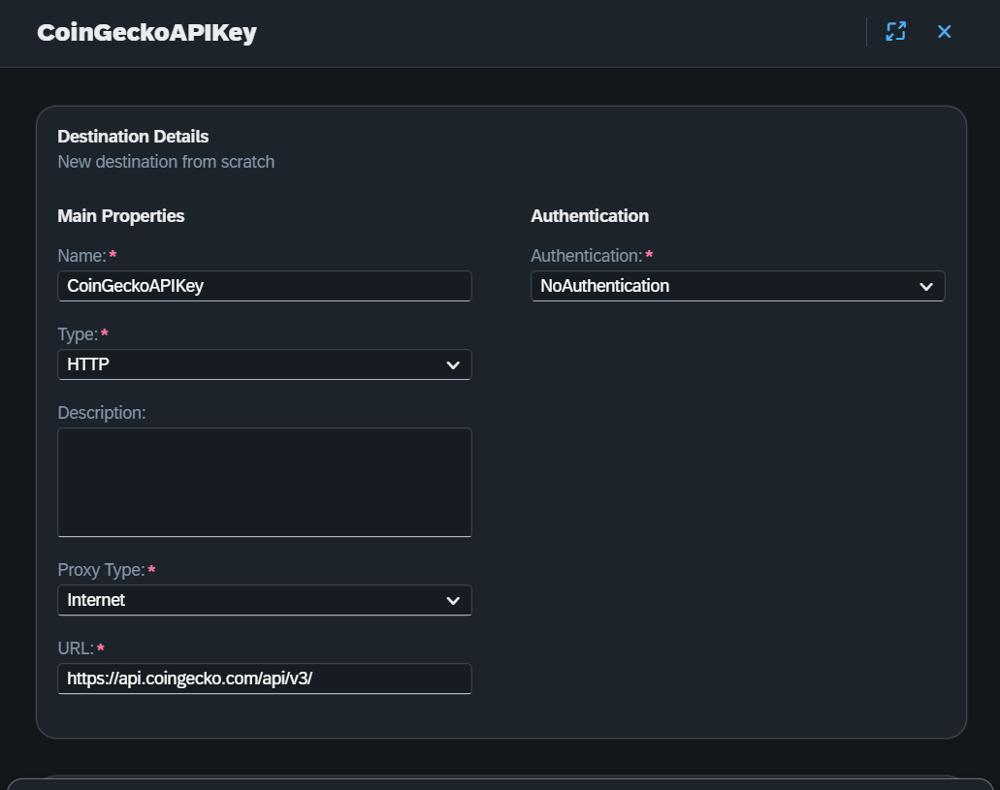
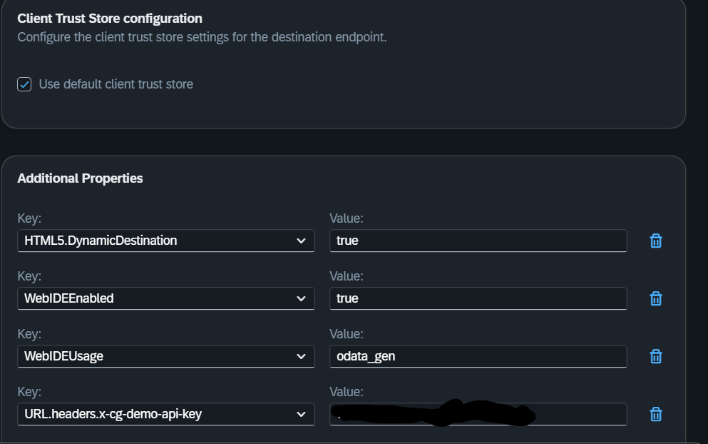
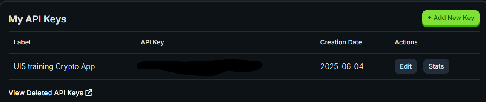

## Application Details

|                                                                                                |
| ---------------------------------------------------------------------------------------------- |
| **Generation Date and Time**<br>Wed Jun 04 2025 08:49:50 GMT+0000 (Coordinated Universal Time) |
| **App Generator**<br>SAP Fiori Application Generator                                           |
| **App Generator Version**<br>1.17.6                                                            |
| **Generation Platform**<br>SAP Business Application Studio                                     |
| **Template Used**<br>Basic                                                                     |
| **Service Type**<br>None                                                                       |
| **Service URL**<br>N/A                                                                         |
| **Module Name**<br>crypto.sap.ui5                                                              |
| **Application Title**<br>Crypto SAP UI5 Training Project                                       |
| **Namespace**<br>crypto.sap.ui5                                                                |
| **UI5 Theme**<br>sap_horizon                                                                   |
| **UI5 Version**<br>1.136.1                                                                     |
| **Enable Code Assist Libraries**<br>False                                                      |
| **Enable TypeScript**<br>True                                                                  |
| **Add Eslint configuration**<br>False                                                          |

## crypto.sap.ui5

A SAP Fiori application for training purposes dedicated to Crypro currencies price action analysis.

### Starting the generated app

- This app has been generated using the SAP Fiori tools - App Generator, as part of the SAP Fiori tools suite. In order to launch the generated app, simply run the following from the generated app root folder (in this case crypto.sap.ui5):

```
    npm start
```

#### Pre-requisites:

1. Active NodeJS LTS (Long Term Support) version and associated supported NPM version. (See https://nodejs.org)

2. Go to [CoinGecko Developers](https://www.coingecko.com/en/developers)

   - Create a Developer's account
   - Under your account create an API key

3. Instructions for API key :

   - Deployment Scenario
      From your SAP BTP Cockpit go to Destinations and fill in the form as follows:

      

      Set the Additional properties as follows:

      

      As value of the key `URL.headers.x-cg-demo-api-key` put your API key from Coin Gecko Dev Dashboard
      

      Deploy the app

   - Development Scenario
      In the ```crypto.sap.ui5``` project in `utils` folder create a file and name it `local-dev-credentials.ts`
      Include the following code in it:
      ```ts
      export const CG_API_KEY = '<your-coin-gecko-api-key>';
      ```

